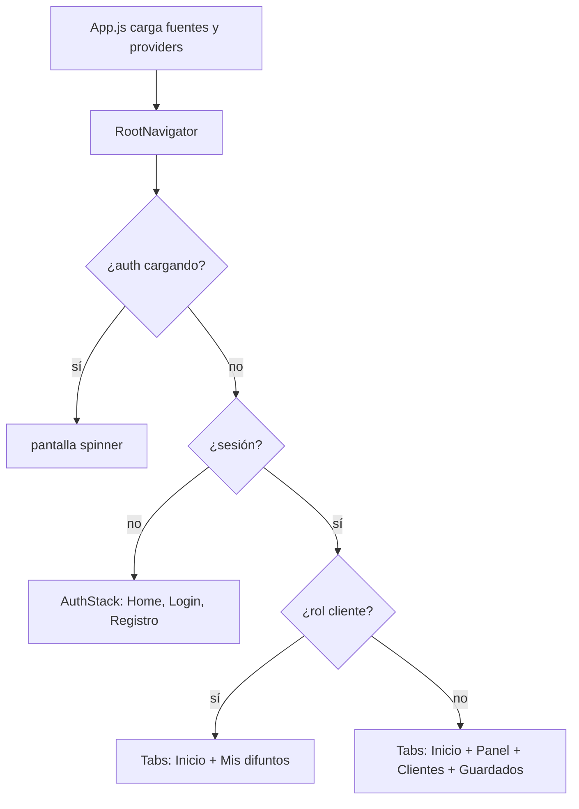

# ⸸ Movil Yomi No Hana - Templo Fúnebre ⸸

**Yomi No Hana** es una aplicación **móvil** para un contexto de **funeraria y cementerio**. Está hecha con **React Native** y **Expo** (SDK 54), y se conecta a un backend **Supabase** (base de datos, autenticación y, donde aplica, datos en tiempo real).

- **Entidad central del negocio en la app:** los **clientes** (tabla `clientes` en Supabase).

### Objetivo de la aplicación móvil

**Objetivo:** que **Yomi No Hana** disponga de un **cliente móvil** fiable y alineado con el negocio funerario y de cementerio, conectado al **mismo Supabase** que otros canales (p. ej. web), para que:

- el **equipo comercial y administración** registre y acompañe **clientes**, use el **panel** (funeraria y cementerio) y trabaje con datos actualizados **desde cualquier lugar**;
- las **familias** con cuenta de **cliente portal** revisen **servicios y reservas** asociados a su perfil;
- cualquier persona pueda **acercarse por contacto** o **registro** desde el teléfono;

En síntesis: **misma verdad de datos en el servidor, mejor experiencia en el móvil** para quien vende, quien administra y quien contrata o consulta.

### Qué problema soluciona la aplicación móvil

La app **no sustituye por sí sola** a un sitio web ni “corrige un bug” genérico de la web: actúa como **otro cliente** del mismo **backend Supabase** (misma URL y clave `anon` que otra app web, si existe). Lo que **sí** aporta es:

| Necesidad | Cómo la cubre esta app |
|-----------|-------------------------|
| **Trabajo fuera del escritorio** | Vendedores y administración pueden usar **Panel** (funeraria, cementerio), **lista de clientes**, detalle y flujos asociados **desde el teléfono**. |
| **Cliente cercano al servicio** | Rol **cliente portal** con **Mis difuntos** para ver servicios y reservas vinculadas a su cuenta sin depender de un PC. |
| **Contacto y captación** | **Inicio** con formulario de contacto y acceso a login/registro para quien aún no tiene cuenta. |
| **Datos vivos en campo** | Listados con **pull-to-refresh** y, donde el backend lo tenga activo, **Realtime** en tablas relevantes. |
| **Comodidad en el dispositivo** | **Tema claro/oscuro** persistente, **favoritos** y **orden de lista** guardados en el teléfono (**AsyncStorage**), navegación nativa (tabs + stacks) y **deep links** para abrir rutas concretas. |
| **Demostración académica** | Cumple el taller integrador: entidad principal, detalle, formularios validados, persistencia local, módulo **Guardados** y prueba en **Expo Go** en dispositivo real. |

En una frase: **lleva el mismo negocio funerario/cementerio al bolsillo**, con roles separados y datos centralizados en Supabase.

### Nota de complejidad (taller)

Lo más complejo de esta aplicación fue **lograr una conexión estable con Supabase** (variables de entorno en Expo, manejo de sesión, y permisos/RLS para poder leer y escribir según el rol), para que el móvil se comporte como un cliente real del mismo backend que la web.

### Otras aplicaciones o productos futuros

Compartiendo el **mismo proyecto Supabase** (modelo de datos, RLS y auth) se pueden desarrollar **otras aplicaciones** sin duplicar la base. Ejemplos de líneas de evolución:

| Aplicación o módulo | Qué podría cubrir |
|---------------------|-------------------|
| **Web de administración ampliada** | Informes, gestión fina de empleados, parametrización y tareas que piden pantalla grande; la móvil sigue orientada a **campo** y **cliente**. |
| **Portal web o PWA para familias** | Seguimiento de servicios, pagos, documentos y mensajería; la app actual ya separa el rol **cliente** y se puede especializar otro front. |
| **Notificaciones push** | Recordatorios de citas, cambios de estado o avisos operativos (el README ya menciona `navigationRef` para navegar al abrir una notificación). |
| **Mapas y visitas** | Localización de **lotes**, rutas dentro del cementerio o registro de visitas con geolocalización. |
| **App de logística u operaciones** | Transporte, flota o inventario conectado al mismo backend. |
| **Kiosko o tablet en recepción** | Registro rápido, turnos o firma de documentos en pantalla fija. |
| **Integraciones de negocio** | Pasarelas de pago, firma digital, CRM o contabilidad vía API o Edge Functions en Supabase. |
| **Calidad de software** | Tests automáticos (unitarios / E2E), monitorización de errores y optimización de rendimiento en listas. |

La estructura de este repo (**Expo**, capas `api/` / `screens/` / `navigation/`) está pensada para **crecer por módulos** o para que **otro equipo** levante un cliente distinto (web, otra app nativa) contra el mismo API.

---

## 2. Ideas que conviene tener claras antes de leer el código

| Concepto | En esta app |
|----------|-------------|
| **Pantalla (`Screen`)** | Un componente React que ocupa toda la vista; vive en `src/screens/`. |
| **Navegación** | **React Navigation**: pestañas abajo (**tabs**) y, dentro de algunas pestañas, **pilas** (**stacks**) para ir “hacia adentro” (lista → detalle → editar). |
| **Estado global de sesión** | `AuthProvider` (`src/contexts/AuthProvider.jsx`): ¿hay usuario logueado?, ¿es cliente o vendedor?, etc. |
| **Tema claro/oscuro** | `ThemeProvider` (`src/contexts/ThemeProvider.jsx`): colores y tipografía coherentes en toda la app. |
| **API / backend** | Llamadas a Supabase en `src/api/`; el cliente configurado en `src/lib/supabase.js`. |
| **Solo en el teléfono** | Favoritos, orden de lista y preferencia de tema se guardan con **AsyncStorage** (`src/data/`). |
| **Mensajes cortos (toast)** | `toastSuccess` / `toastError` / `toastInfo` en `src/lib/appToast.js` sobre **`react-native-toast-message`**; el aspecto sigue el tema en `ThemedToast`. |

---

## 3. Stack técnico

| Capa | Tecnología |
|------|------------|
| App | React Native, **Expo SDK 54** |
| Navegación | React Navigation 7 (bottom tabs + native stack) |
| Backend | Supabase (Auth, Postgres, RLS, Realtime en tablas usadas) |
| Persistencia local | `@react-native-async-storage/async-storage` (favoritos, orden de lista, sesión, preferencia de tema) |
| Gestos / root wrappers | `react-native-gesture-handler` + `SafeAreaProvider` (mejor respuesta táctil y soporte edge-to-edge) |
| Fuentes | `@expo-google-fonts` (Cinzel Decorative, Cormorant) en `App.js` |
| Mensajes no bloqueantes | **`react-native-toast-message`** (toasts con tema en `src/components/ThemedToast.jsx`; API cómoda en `src/lib/appToast.js`) |

---

## 4. Cómo “arranca” la app: del `App.js` a la pantalla

Sigue este orden la primera vez que abras el proyecto:

1. **`App.js` (raíz del proyecto)**  
   - Carga las **fuentes** con `useFonts`. Mientras cargan, muestra un fondo oscuro y un indicador de carga.  
   - Envuelve todo con `GestureHandlerRootView` + `SafeAreaProvider`, y luego con **`ThemeProvider`** (tema) y **`AuthProvider`** (sesión).  
   - En **`AppShell`**: **`RootNavigator`** (navegación), **`ThemedToast`** (capa global de toasts) y **`StatusBar`** según tema claro u oscuro.

2. **`RootNavigator.js`**  
   - Mientras `AuthProvider` termina de saber si hay sesión, muestra una **pantalla de carga** (spinner).  
   - Cuando ya sabe:  
     - **Sin sesión** → muestra **`AuthStack`** (flujo público: inicio, login, registro).  
     - **Con sesión** → muestra **`MainTabs`** (pestañas según el rol).

3. **Dentro de `MainTabs` o `AuthStack`**  
   - Cada “ruta” apunta a un **componente pantalla** en `src/screens/`.

Así puedes localizar cualquier cosa: *¿quién decide si veo login o las pestañas?* → `RootNavigator.js` + `useAuth()`.

### Toasts y mensajes cortos

Para **avisos breves** (validación, éxito, error de red) la app usa **`react-native-toast-message`** en lugar de tapar la pantalla con muchos `Alert` nativos.

| Pieza | Archivo / uso |
|-------|----------------|
| **Instancia visual** | `src/components/ThemedToast.jsx` — montada en **`App.js`** (`AppShell`), después de `RootNavigator`, para que herede **`useTheme()`** (colores y tipografía Cormorant en los tipos `success`, `error`, `info`). |
| **API en código** | `src/lib/appToast.js` — exporta **`toastSuccess`**, **`toastError`** y **`toastInfo`** (títulos en `text1`, detalle opcional en `text2`). |
| **Dependencia npm** | **`react-native-toast-message`** (compatible con Expo; instalación típica: `npx expo install react-native-toast-message`). |

**`Alert.alert` de React Native** se reserva donde hace falta **elegir una opción** o **confirmar** algo destructivo: por ejemplo **eliminar cliente** (detalle) y el diálogo **Ordenar por** en la lista de clientes.

---

## 5. Usuarios, roles y qué ve cada uno

Los roles vienen del perfil en Supabase (**`user_profiles.rol`**). Resumen:

| Rol (`user_profiles.rol`) | Quién es | Pestañas típicas |
|---------------------------|----------|------------------|
| **2** | Vendedor | Inicio, Panel, Clientes, Guardados |
| **666** | Administrador | Lo mismo + acceso a **Administración** dentro del Panel |
| **3** | Cliente (portal) | Inicio, **Mis difuntos** (no ve Panel ni listado de clientes de gestión) |

**Regla importante:** si un vendedor está **inactivo** en la tabla de empleados, la app **cierra sesión** (lógica en el provider de autenticación).

**Sin iniciar sesión:** solo el flujo público del **`AuthStack`**: pantalla de inicio (contacto, login, registro de cliente). No hay Panel ni lista de clientes de gestión.

---

## 6. Mapa de pantallas y navegación

### 6.1 Sin sesión (`AuthStack`)

Orden lógico del stack (nombres internos de ruta → pantalla):

| Ruta | Pantalla (`src/screens/`) | Título en cabecera |
|------|---------------------------|---------------------|
| `Home` | `HomeScreen.js` | Yomi No Hana |
| `Login` | `LoginScreen.js` | Iniciar sesión |
| `RegistroCliente` | `RegistroClienteScreen.js` | Registro cliente |

Desde **Inicio** el usuario puede ir a login o registro; el contenido de inicio (contacto, apariencia, etc.) es el mismo tipo de pantalla que verá también como pestaña cuando ya esté logueado (mismo componente `HomeScreen`).

### 6.2 Con sesión — vendedor o admin (`MainTabs`)

Pestañas inferiores:

| Pestaña | Contenido |
|---------|-----------|
| **Inicio** | `HomeScreen` — marca, contacto, apariencia (tema), accesos según sesión |
| **Panel** | `PanelStack` — ver §6.3 |
| **Clientes** | `ClientesStack` — ver §6.4 |
| **Guardados** | `GuardadosScreen.js` — favoritos locales |

### 6.3 Stack del Panel (`PanelStack`)

| Ruta | Pantalla | Título |
|------|----------|--------|
| `Dashboard` | `DashboardScreen.js` | Panel |
| `Funeraria` | `FunerariaScreen.js` | Funeraria |
| `Cementerio` | `CementerioScreen.js` | Cementerio |
| `Admin` | `AdminScreen.js` | Administración |

### 6.4 Stack de Clientes (`ClientesStack`)

| Ruta | Pantalla | Título |
|------|----------|--------|
| `ClientesList` | `ClientesListScreen.js` | Clientes |
| `ClienteDetail` | `ClienteDetailScreen.js` | Detalle |
| `ClienteNuevo` | `ClienteNuevoScreen.js` | Nuevo cliente |
| `ClienteEditar` | `ClienteEditarScreen.js` | Editar contacto |

### 6.5 Con sesión — cliente portal (`MainTabs` reducido)

| Pestaña | Pantalla |
|---------|----------|
| **Inicio** | `HomeScreen` |
| **Mis difuntos** | `MiCementerioScreen.js` |

### 6.6 Diagrama rápido (quién ve qué)



---

## 7. Qué hace cada parte de la app (módulo por módulo)

### Inicio (`HomeScreen`)

- Identidad visual (fondo con degradado `GothicBackground`, tipografía).
- Formulario de **contacto** (público); envío vía API de solicitudes.
- **Apariencia:** selector **compacto** (segmentado) para **tema claro / oscuro** (se guarda en el dispositivo).
- **Acceso (compacto, debajo de Servicios):** botones **Iniciar sesión** y **Cuenta cliente** cuando no hay sesión. Con sesión muestra tarjeta de presencia + **Cerrar sesión**.
- **Pull-to-refresh:** el `ScrollView` de `ScreenScroll` soporta `RefreshControl`; en Inicio se usa para re-leer sesión (`supabase.auth.getSession()`).
- **Servicios (modales informativos):**
  - **Funeraria:** muestra **lista de servicios y precios** desde `SERVICIOS_FUNERARIA` (constantes).
  - **Cementerio:** muestra **lotes y precios** desde Supabase (`lotes`), más un bloque de **cargos adicionales**.
  - Importante: estos modales **no obligan** a navegar a login; el ingreso está en el bloque **Acceso**.

### Panel (`DashboardScreen` y stacks hijos)

- **Dashboard:** punto de entrada al panel comercial.
- **Funeraria:** venta / gestión de línea funeraria; datos en Supabase; donde aplica, **Realtime** (hooks en `src/hooks/`).
- **Cementerio:** reservas y lotes relacionados con cementerio; también Realtime donde esté configurado.
- **Cementerio (catálogo visible):** además del flujo de reserva, muestra un bloque **Catálogo de lotes** (nombre + precio + ocupación) con botón **Actualizar**.
- **Administración** (sobre todo rol 666): acciones como vínculos por cédula y listado de solicitudes (la gestión pesada de empleados puede vivir en otras herramientas).

Desde el **detalle de un cliente** se puede pasar a funeraria o cementerio con la **cédula** ya cargada para agilizar el flujo.

### Clientes (`ClientesListScreen` → detalle → nuevo / editar)

- **Lista:** datos desde Supabase; **búsqueda** por nombre o cédula; **orden** configurable (preferencia guardada en el dispositivo).
- **Pull-to-refresh:** deslizar hacia abajo para recargar.
- **Detalle:** ver datos del cliente; marcar **favorito** (se guarda localmente en **Guardados**); acciones como venta funeraria/cementerio; **eliminar** cliente si las políticas lo permiten.
- **Detalle (refresco):** soporta **pull-to-refresh** para recargar cliente/servicios/reservas sin salir de la pantalla.
- **Nuevo / Editar:** formularios con **validación** (campos obligatorios, mensajes claros).

### Guardados (`GuardadosScreen`)

- Módulo **personal** del taller: muestra clientes marcados como favoritos.
- Los IDs favoritos viven en **AsyncStorage**; al abrir la pantalla se reconcilian con datos actuales desde la API.

### Mis difuntos (`MiCementerioScreen` + bloques relacionados)

- Para el **cliente portal:** servicios y reservas vinculados a su cuenta (incluye piezas como `CementerioReservasBlock.js` donde aplique).

### Detalles de implementación útiles al leer código

- **Navegación y tema:** `NavigationContainer` en `RootNavigator.js` usa los mismos colores que `ThemeProvider` (fondo, tarjetas, texto, borde, primario).
- **Teclado:** en tabs, `tabBarHideOnKeyboard: true` para que la barra inferior no tape campos al escribir.
- **Barra inferior (tabs):** configuración en `src/navigation/MainTabs.js`.
  - Estilo **compacto** y **solo iconos** (`tabBarShowLabel: false`) para diferenciarla de los botones del sistema Android.
  - Respeta **Safe Area** (inset inferior) para que los toques funcionen bien en Android con navegación por gestos / edge-to-edge.
  - Cambia pestañas según rol: cliente portal ve **Inicio + Mis difuntos**; vendedor/admin ve **Inicio + Panel + Clientes + Guardados**.
- **Referencia global de navegación:** `src/navigation/navigationRef.js` — para navegar desde sitios sin prop `navigation` (por ejemplo, futuras notificaciones). Antes de navegar, conviene comprobar `navigationRef.isReady()`.
- **Toasts:** ver [§ Toasts y mensajes cortos](#toasts-y-mensajes-cortos); desde una pantalla importá `../lib/appToast` (ruta relativa según carpeta).

---

## 8. Datos: internet (Supabase) vs teléfono (AsyncStorage)

| Dónde | Qué se guarda |
|-------|----------------|
| **Supabase** | Clientes, servicios, reservas, lotes, solicitudes de contacto, perfiles, empleados, etc. Las reglas (**RLS**) deciden qué puede leer o escribir cada rol. |
| **AsyncStorage (solo móvil)** | IDs de **favoritos**, **orden** de la lista de clientes, **modo de tema** (clave como `@yomi_theme_mode`), y la **sesión** de Supabase (según configuración en `lib/supabase.js`). |

Concepto clave para aprender: **la fuente de verdad del negocio está en el servidor**; lo local son **preferencias** y **marcadores** que mejoran la UX en el dispositivo.

---

## 9. Requisitos en tu máquina

| Herramienta | Notas |
|-------------|--------|
| **Node.js** LTS (20.x o 22.x) | [nodejs.org](https://nodejs.org) — comprueba con `node -v` y `npm -v` |
| **Editor** | VS Code, Cursor, etc. |
| **Expo Go** en el teléfono | Misma **SDK 54** que el proyecto |
| **Proyecto Supabase** | URL del proyecto y clave **anon** (Settings → API). Si el proyecto está **pausado**, usa **Resume project** en el dashboard. |

---

## 10. Instalación y arranque (paso a paso)

Sigue estos pasos **la primera vez** que abres el repositorio:

1. **Abre la carpeta correcta**  
   Debe contener `package.json` y este `README` en la misma raíz.

2. **Instala dependencias** (en esa carpeta):
   ```bash
   npm install
   ```

3. **Crea el archivo de entorno**  
   - En Windows (cmd): `copy .env.example .env`  
   - O copia manualmente `.env.example` y renómbralo a `.env`.

4. **Rellena Supabase**  
   En [Supabase Dashboard](https://supabase.com/dashboard) → tu proyecto → **Settings → API**:  
   - Copia **Project URL**  
   - Copia la clave **anon public**  

   Pégalas en `.env` así:
   ```env
   EXPO_PUBLIC_SUPABASE_URL=https://TU-REF.supabase.co
   EXPO_PUBLIC_SUPABASE_ANON_KEY=eyJ...
   ```

   Las variables que empiezan por `EXPO_PUBLIC_` las expone Expo al código JavaScript del cliente (cualquiera que instale la app puede verlas en el binario; por eso solo va la clave **anon**, nunca la **service role**).

5. **Guarda** `.env`. Si cambias algo después, **reinicia** el servidor de desarrollo (Ctrl+C y vuelve a ejecutar `npx expo start`).

6. **Arranca la app** (siguiente sección).

---

## 11. Ejecutar en desarrollo

En la raíz del proyecto:

```bash
npx expo start
```

Si vienes de un estado raro (cambiaste `.env`, instalaste dependencias o Metro quedó “pegado”), usa el arranque con limpieza de caché:

```bash
npx expo start -c
```

Equivalente:

```bash
npm start
```

- Aparece un **código QR** en la terminal: ábrelo con **Expo Go** en el teléfono (misma SDK que el proyecto).  
- Para sustentaciones del taller conviene probar en **teléfono físico**.  
- En la terminal, **`a`** / **`w`** abren Android o web si los tienes configurados.

> Nota (Windows / PowerShell): para encadenar comandos en una misma línea usa `;` en lugar de `&&`.

---

## 12. Deep linking (enlaces que abren la app)

En `app.json` el **scheme** es **`yominohana-mobile`**. La configuración de rutas según sesión y rol está en `src/navigation/rootLinking.js`.

**Ejemplos de rutas** (cuando la app está instalada y el enlace es compatible):

| Situación | Ejemplos de path |
|-----------|------------------|
| Sin sesión | `yominohana-mobile://login`, `yominohana-mobile://registro` |
| Vendedor/admin | `…/panel/funeraria`, `…/clientes/detalle/:id`, `…/guardados` |
| Cliente | `…/mis-difuntos` |

Los prefijos se generan con `expo-linking` (`Linking.createURL('/')`). Si un enlace no abre la pantalla esperada, revisa que el usuario tenga el **rol correcto** y que la ruta exista en `buildRootLinking`.

---

## 13. Cumplimiento del taller integrador (PDF)

| Requisito (PDF) | Implementación en esta app |
|-----------------|----------------------------|
| Inicio con identidad y acceso al flujo | Pantalla **Inicio** |
| Listado de la entidad principal | **Clientes** |
| Detalle | **Detalle de cliente** |
| Formulario de alta + validación | **Nuevo cliente** y **Registro cliente** |
| Búsqueda, filtrado u orden | Búsqueda + **orden** de lista |
| Módulo personal | **Guardados** |
| Persistencia local | Favoritos, orden, sesión, preferencia de tema |
| Navegación entre pantallas | Tabs + stacks |
| Código organizado | Carpetas bajo `src/` |
| Expo blank + `npx expo start` + Expo Go SDK 54 | Proyecto en la raíz |

---

## 14. Guión de demostración y checklist

### Guión sugerido (orden para mostrar la app)

1. Enunciado del **problema** y del **público** (una frase).  
2. **Inicio:** contacto, información de servicios; **Apariencia** (tema claro ↔ oscuro).  
3. **Registro cliente** o **login**.  
4. Flujo **vendedor:** **Panel** → Funeraria o Cementerio.  
5. **Clientes:** lista, búsqueda, orden, **pull-to-refresh**.  
6. **Detalle:** favoritos / guardados; funeraria o cementerio con cédula; opcional **eliminar cliente**.  
7. **Guardados:** cerrar la app por completo y verificar que los favoritos siguen.  
8. **Nuevo cliente** con validación (intentar enviar vacío).  
9. **Editar cliente**.  
10. (Opcional) **Administración** y **cliente portal**.

### Checklist al probar (taller genérico → esta app)

Usa un usuario **vendedor o admin** para catálogo, detalle y guardados. El **cliente portal** no tiene la pestaña **Clientes**.

| Paso del checklist | Dónde probarlo |
|--------------------|----------------|
| Inicio — textos y contacto | Tab **Inicio**; validación si faltan campos en contacto. |
| Catálogo — buscar, ordenar, refrescar, detalle | Tab **Clientes**; **Orden**; pull-to-refresh; tocar fila → **Detalle**. |
| Detalle — favorito; eliminar | **Detalle**; guardar/quitar guardados; **Eliminar cliente** si aplica. |
| Favoritos persistentes | Tab **Guardados**; cerrar app y volver. |
| Nuevo — alta y validación | **Nuevo cliente**; enviar sin obligatorios → **toast** de aviso. |
| Tema y sesión | **Inicio** → **Apariencia**; login / logout; **Registro** desde flujo sin sesión. |

---

## 15. Evolución sugerida por semanas

| Semana | Enfoque sugerido |
|--------|------------------|
| 1 | Tema, problema, proyecto Expo blank ejecutando |
| 2 | Inicio, lista de clientes, identidad visual |
| 3 | Navegación, detalle, favoritos |
| 4 | Formularios y validaciones |
| 5 | AsyncStorage, guardados, búsqueda/orden |
| 6 | Panel funeraria/cementerio, integración, README, prueba en Expo Go |

---

## 16. Estructura de carpetas (`src/`) explicada

```
src/
  api/          Llamadas a Supabase: clientes, servicios, reservas, lotes, admin, contacto
  components/   UI reutilizable: fondo, scroll, ornamentos, **`ThemedToast`**, etc.
  constants/    Reglas de negocio (p. ej. yomiBusiness)
  contexts/     Auth (sesión) y ThemeProvider (tema claro/oscuro)
  data/         Lectura/escritura en AsyncStorage: favoritos, orden, tema
  hooks/        Suscripciones Realtime a tablas de Supabase
  lib/          Cliente Supabase (`supabase.js`) y **`appToast.js`** (toasts)
  navigation/   RootNavigator, tabs, stacks, navigationRef, rootLinking.js
  screens/      Una carpeta por “pantalla” de usuario
  theme/        Paletas darkPalette / lightPalette y tipografía
  utils/        Ayudas para ordenar y filtrar listas en el cliente
assets/         Imágenes, iconos, fuentes adicionales si las hubiera
```

---

## 17. Problemas frecuentes

| Síntoma | Qué hacer |
|---------|-----------|
| URL `placeholder.supabase.co` o pantalla en blanco | Revisa `.env` y reinicia `npx expo start` |
| Permisos / errores de lectura en tablas | Usuario y **RLS** en Supabase acordes al rol |
| No aparecen lotes en Inicio / Cementerio | Revisa RLS en `lotes`: policy de **SELECT** para `authenticated` (si quieres solo logueados) o también para `anon` (si quieres catálogo público). Si la policy filtra por rol, `USING` puede devolver 0 filas aunque existan. |
| Expo Go “SDK incompatible” | Actualiza Expo Go; el proyecto usa **SDK 54** |
| Mis difuntos vacío | Puede ser normal si no hay datos o vínculos en backend |
| Errores de red | Proyecto Supabase pausado → **Resume** en el dashboard |
| Deep link no abre la pantalla esperada | Sesión, rol y `rootLinking.js` deben coincidir con la ruta |
| No aparece ningún toast | Comprueba que **`ThemedToast`** siga renderizado en `App.js` / `AppShell` y que llames a `toastSuccess` / `toastError` / `toastInfo` desde código que ya se ejecutó tras el login |
| Expo Go muestra `Cannot find module 'babel-preset-expo'` (Metro 500) | Instala el preset y reinicia con caché limpia: `npm i -D babel-preset-expo@~54.0.10 @babel/core` y luego `npx expo start -c` |
| `Port 8081 is being used by another process` | Cierra el proceso que usa el puerto o arranca Expo en otro: `npx expo start --port 8082` (o 8083, etc.) |
| Expo Go “Failed to download remote update” | Casi siempre es conectividad: teléfono y PC en la **misma Wi‑Fi**, sin VPN, y permitir Node/Expo en el **Firewall** de Windows (red privada). Si tu red bloquea LAN, usa modo **Tunnel** desde el menú (`m` en la terminal). |
| Se queda en “Bundling 100%” | Abre la consola donde corre Expo y mira el error real (normalmente hay un `TypeError` / `Cannot find module`). Reinicia con `npx expo start -c`. Si el problema persiste en Expo Go, desactiva `newArchEnabled` en `app.json` y vuelve a arrancar. |

---

## 18. Backend (Supabase) y relación con otras apps

La app **no incluye** el esquema SQL en este repositorio: tablas, **RLS**, funciones **RPC** y **Realtime** se definen en tu **proyecto Supabase** (editor SQL o migraciones).

- **Auth:** email y contraseña; metadatos en el registro según la pantalla de registro cliente.  
- **Datos típicos:** `clientes`, `servicios_funerarios`, `reservas_cementerio`, `lotes`, `solicitudes_contacto`, perfiles, empleados, según tus políticas.  
- **Realtime:** tablas habilitadas para replicación en el dashboard.

Si en tu organización hay **otra aplicación** (por ejemplo **web**) que use el **mismo** proyecto Supabase, solo comparten **URL** y clave **anon**; no hace falta duplicar la lógica móvil en el repo web. Carpetas locales de otros proyectos puedes ignorarlas con `.gitignore` para no mezclar entregas.

---

## 19. Comandos útiles y dependencias

```bash
npm start
npm run android
npm run ios
```

**Dependencias relevantes:** `expo`, `expo-linking`, `@react-navigation/native`, `@react-navigation/bottom-tabs`, `@react-navigation/native-stack`, `@supabase/supabase-js`, `@react-native-async-storage/async-storage`, `expo-linear-gradient`, `expo-font`, **`react-native-toast-message`** (toasts globales; ver [Toasts y mensajes cortos](#toasts-y-mensajes-cortos)).

Si clonas el repo en otra máquina, **`npm install`** ya incluye `react-native-toast-message` por el `package.json`. Para añadirla manualmente en un proyecto Expo alineado: `npx expo install react-native-toast-message`.

---

## 20. Ampliaciones técnicas en el código

Además de las líneas de producto y aplicaciones futuras, a nivel de implementación se puede sumar:

- **Notificaciones push** (aprovechando `navigationRef`)
- Subir foto del difunto con **expo-image-picker**
- Modo **offline** con cola de sincronización
- Comprobante de pago en **PDF** descargable desde el celular
- **Mapas**, **tests automáticos** y **optimización** de listas y pantallas

---
